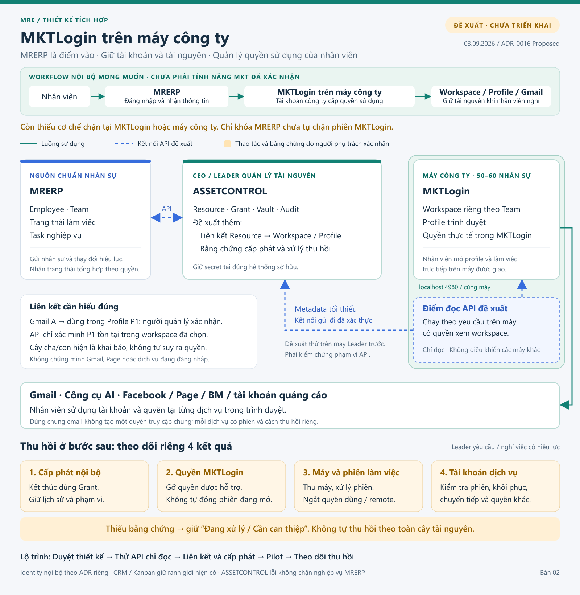
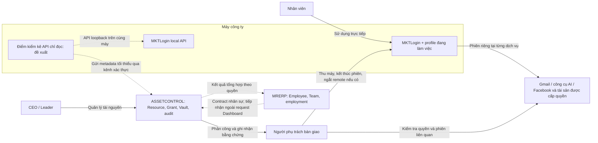
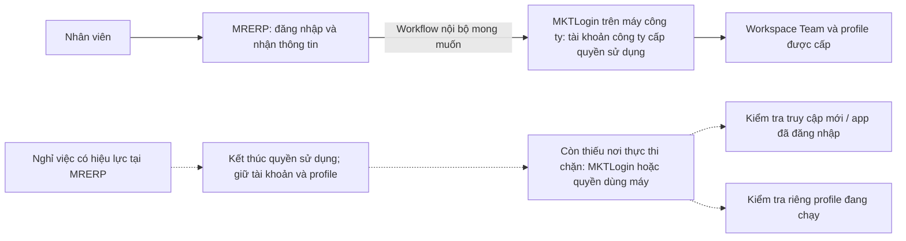
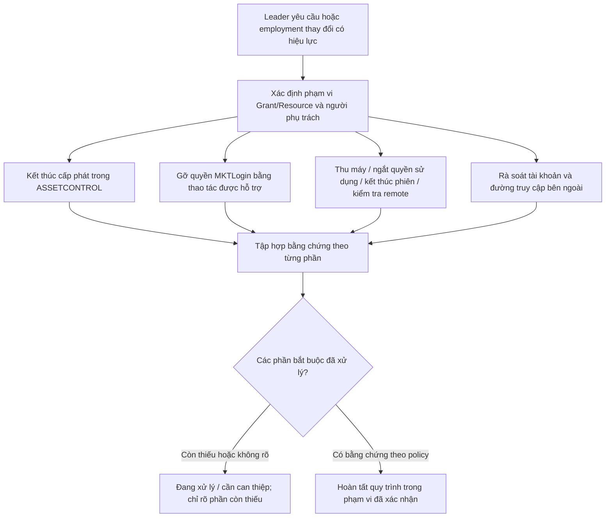

# Đề xuất tích hợp MKTLogin trên máy công ty

Ngày: 03/09/2026. Trạng thái: **Đề xuất mục tiêu — để duyệt, chưa triển khai**.

**Bản 02 — cập nhật theo phương án họp nội bộ của công ty:** dự kiến dùng gói MKTLogin công ty, MRERP là điểm vào, tài khoản con/ứng dụng được chuẩn bị trên máy và nhân viên không tự nhập credential. Người dùng đã làm rõ đây **không phải khả năng MKT xác nhận**. Mục tiêu nghỉ việc là cắt quyền sử dụng của nhân viên, giữ nguyên tài khoản/profile và tài nguyên công ty. Cơ chế thực thi còn thiếu, được ghi nhận tại [mục 5.6 của tài liệu tích hợp](ecosystem-integration.md#56-bổ-sung-từ-người-dùng-gói-công-ty-và-tài-khoản-thành-viên).

Tài liệu này cụ thể hóa phương án đang xem xét trong [tích hợp hệ sinh thái](ecosystem-integration.md), đi cùng [ADR-0016 Proposed](../decisions/0016-mktlogin-company-device-integration-proposal.md). Đây là thiết kế đề xuất, không thay thế các source of truth đã chốt hoặc tài liệu/code ASSETCONTROL chưa được kiểm tra. Không có thay đổi application, migration, credential hay quyền thật trong lượt thiết kế này.

## 1. Phương án khuyến nghị

Giữ MKTLogin trên máy công ty như cách nhân viên đang làm việc. ASSETCONTROL quản lý tài nguyên, cấp phát và bằng chứng bàn giao/thu hồi. MRERP cung cấp nhân sự, Team và trạng thái làm việc. Thêm kết nối API **chỉ đọc** để kiểm chứng workspace/profile; thao tác quyền MKTLogin và kiểm soát máy ban đầu do người được phân công thực hiện, có ghi nhận kết quả.

Theo workflow mong muốn, nhân viên bắt đầu từ MRERP rồi dùng MKTLogin bằng tài khoản công ty cấp quyền sử dụng. Thiết kế bổ sung liên kết nhân viên–quyền sử dụng MKTLogin và nơi thực thi việc chấm dứt quyền khi nghỉ việc. **Giữ nguyên tài khoản/profile không đồng nghĩa giữ quyền của người nghỉ việc. Công cụ chỉ đọc không tự chặn được MKTLogin từ MRERP.** Nếu bước đầu còn bàn giao máy/gỡ quyền thủ công thì ghi rõ phần đó, chưa tuyên bố đã có cơ chế tự động.

Không lấy hệ thống remote desktop hoặc chương trình cưỡng chế chạy trên toàn bộ 50–60 máy làm điều kiện bắt đầu. Khi bàn giao máy không đáp ứng yêu cầu vận hành thực tế, đánh giá phần mềm quản trị thiết bị hoặc cơ chế điều khiển cục bộ trong quyết định riêng.

Mục tiêu bước đầu là trả lời đúng: **ai đang được giao tài nguyên nào, dùng profile nào, profile đó đã được kiểm chứng khi nào**. Mục tiêu thu hồi về sau là **chấm dứt cấp phát và kiểm tra các đường truy cập còn tồn tại**, không hứa thu lại dữ liệu đã bị sao chép.

## 2. Căn cứ và giới hạn đã biết

| Nội dung | Trạng thái và nguồn |
|---|---|
| MKTLogin là sản phẩm ngoài, ASSETCONTROL sở hữu Resource/Grant/Vault/audit, MRERP sở hữu Employee/Team | **Đã chốt**, ADR-0014 và data ownership |
| Các Team sẽ có workspace riêng | **Đã chốt**, ADR-0015; chưa kiểm kê workspace thực tế |
| Công ty sẽ mua một gói; nhân sự dùng tài khoản con trong tài khoản tổng công ty | Phương án nội bộ do người dùng cung cấp; chưa có tên gói và mô hình ID/quyền trong tài liệu kỹ thuật |
| Nhân sự bắt đầu từ MRERP, nhận thông tin rồi dùng MKTLogin có sẵn trên máy mà không tự nhập tài khoản/mật khẩu | Workflow nội bộ mong muốn; chưa xác định cách chuẩn bị phiên hoặc hỗ trợ SSO |
| Cho nghỉ từ MRERP thì nhân viên mất quyền dùng MKTLogin, còn tài khoản/profile/tài nguyên giữ nguyên | Yêu cầu người dùng làm rõ; chưa có cơ chế thực thi hoặc bằng chứng đạt yêu cầu |
| Khoảng 50–60 nhân sự cần dùng MKTLogin | Người dùng xác nhận; chưa biết số người/profile chạy đồng thời |
| MKTLogin tiếp tục nằm trên máy công ty | Ràng buộc người dùng đưa ra cho phương án này; không suy ra đã có quản trị thiết bị tập trung hoặc thu máy đầy đủ |
| Tài nguyên gồm Gmail thường, Via, Page, tài khoản quảng cáo, BM; cây cha/con do người quản lý khai báo | Người dùng mô tả hiện trạng ASSETCONTROL; chưa audit code/UI/model của product đó |
| Gmail là tài khoản thông thường, không phải tài khoản Google Workspace do tổ chức quản trị | Người dùng xác nhận; không dùng Google Admin API làm giả định đổi mật khẩu |
| OpenAPI trong MKTLogin 2.1.3 mô tả API tại localhost:4980 | Đã đọc tài liệu; chưa gọi API thật |
| Gỡ quyền không đóng profile đang mở; thành viên vẫn sử dụng được | Phản hồi nhà cung cấp do người dùng chuyển tiếp |
| Nhà cung cấp trả lời không thực hiện được API gỡ quyền/buộc đóng trên máy thành viên khi được hỏi | Phản hồi do người dùng chuyển tiếp; không hứa chức năng remote revoke qua API hiện có |
| Mở lại sau khi gỡ quyền, offline, đồng bộ/export profile, hạn chế đăng nhập trên máy ngoài công ty, phạm vi tài khoản API | **Chưa kiểm chứng** |

Chi tiết API và nguồn phản hồi nằm tại [mục 5 của tài liệu tích hợp](ecosystem-integration.md#5-mktlogin-integration). Hướng dẫn Google được dùng để đánh giá rủi ro phiên bên ngoài, không để chọn Google làm Identity Provider MRERP.

## 3. Bản vẽ tổng thể

[Bản vẽ vector để phóng to](diagrams/mktlogin-company-device-overview.svg).

Nét xanh liền: luồng sử dụng/nghiệp vụ. Nét xanh đứt: kết nối dữ liệu đề xuất, chưa hiện thực. Nét cam: việc do người phụ trách thực hiện và ghi nhận. Mũi tên không biểu thị API đã tồn tại nếu chưa được ghi rõ.

Điểm kiểm kê có thể nằm trên máy Leader đang có quyền xem workspace, sau khi kiểm chứng phạm vi API; không mặc định máy đó đọc được toàn công ty. Trình duyệt đang chạy trên các máy khác không được quan sát hoặc điều khiển chỉ nhờ điểm kiểm kê này.

### 3.1 Luồng tài khoản thành viên bổ sung

Mũi tên từ MRERP sang app mô tả workflow, chưa chứng minh đã có deep link hoặc SSO. Nhân viên không cần đi qua giao diện ASSETCONTROL; quyền truy cập ASSETCONTROL vẫn chỉ dành cho CEO/Leader. Gói/tài khoản tổng do công ty quản lý không có nghĩa mọi nhân viên dùng chung credential tổng.

## 4. Ranh giới các thành phần

| Thành phần | Sở hữu hoặc chịu trách nhiệm | Giới hạn |
|---|---|---|
| MRERP | Employee, Team, employment, capability hệ sinh thái; Task nghiệp vụ nếu dùng để nhắc xử lý | Không lưu mật khẩu/phiên MKTLogin hoặc Google; khóa account không chứng minh thu hồi tài nguyên |
| ASSETCONTROL | Resource, quan hệ tài nguyên, Grant, Vault, audit; đề xuất sở hữu liên kết profile và hồ sơ xử lý thu hồi | Repo/deployment riêng; không tự tạo Employee/Team cạnh tranh |
| MKTLogin | Workspace, profile, thành viên/quyền thực tế và môi trường vận hành của sản phẩm | API đọc chưa chứng minh tài khoản website đang đăng nhập; gỡ quyền không ngắt phiên hiện tại |
| Điểm kiểm kê API cục bộ | Đề xuất công cụ tích hợp thuộc phạm vi ASSETCONTROL, đọc API trên cùng máy và gửi kết quả lọc | Không chứa bản sao Vault, không có quyền chạy lệnh tùy ý, không mở/đóng profile trong bản đầu |
| Người phụ trách máy và tài khoản | Bàn giao máy, kết thúc phiên, kiểm tra quyền truy cập ngoài MKTLogin | Actor và bằng chứng cần duyệt ở OD-28; không tự mở ASSETCONTROL cho IT/HR/Staff |
| Google và từng dịch vụ | Tài khoản, phiên, quyền tại dịch vụ nguồn | Không có quan hệ thu hồi tự động chỉ vì dùng chung email |
| Identity chung | Credential và phiên đăng nhập các product nội bộ theo thiết kế được duyệt | Provider, service authentication và migration login vẫn chưa chọn |
| MRECRM / MREKANBAN | Giữ ownership đã chốt; Kanban tham chiếu Task MRERP | Không mở thêm triển khai hai product trong bản tích hợp này |

MRERP Dashboard chỉ đọc snapshot cục bộ khi luồng tích hợp đó được triển khai. ASSETCONTROL/MKTLogin lỗi không được chặn HR, Task hoặc xác nhận trạng thái nghỉ việc trong MRERP. Kết quả tài nguyên đồng bộ chậm phải có thời điểm và trạng thái còn chờ.

## 5. Mô hình tài nguyên đề xuất

Các tên dưới đây mô tả thông tin nghiệp vụ cần có, chưa phải migration hoặc schema được duyệt. Kiểm tra model thực tế trong ASSETCONTROL trước khi tạo bảng hoặc trường mới.

| Thông tin | Nội dung tối thiểu đề xuất |
|---|---|
| Resource hiện có | UUID nội bộ, loại tài nguyên, tên, định danh dịch vụ nếu có, phạm vi quản lý; Gmail vẫn là Resource |
| Quan hệ tài nguyên hiện có | Giữ cha/con đã khai báo; thêm ý nghĩa quan hệ và nguồn xác nhận khi phù hợp, không tự viết lại cây |
| Liên kết Team–workspace | Team UUID MRERP và định danh workspace MKTLogin; không khóa bằng tên hiển thị |
| Liên kết nhân viên–thành viên MKTLogin | Employee UUID, định danh tài khoản/thành viên MKT và phạm vi công ty/workspace đã kiểm chứng; tên/email chỉ là thông tin hiển thị, không tự khóa bằng Gmail Resource |
| Liên kết profile | UUID nội bộ, workspace/profile ID từ API, ngữ cảnh nguồn, lần quan sát thành công và kết quả kiểm tra gần nhất |
| Quan hệ Resource–profile | Resource được sử dụng trong profile nào, ai xác nhận, thời điểm; có thể nhiều-nhiều, chưa ép một Gmail/một người/một profile |
| Grant | Nhân viên được giao, các Resource cụ thể, quyền được giao, thời gian hiệu lực, người giao; dùng semantics hiện có sau audit |
| Thông tin máy sử dụng | Mã máy tham chiếu sổ thiết bị được công ty chọn, người đang giữ máy, người nhận bàn giao; không tự xây module quản trị thiết bị |
| Hồ sơ xử lý thu hồi | Nhân viên, phạm vi tài nguyên, lý do/thời điểm hiệu lực, người phụ trách, trạng thái từng bước và bằng chứng không chứa secret |

**Gmail là đầu mối tổ chức, không phải khóa quyền chung.** Một quan hệ “email đăng ký” khác “email khôi phục”, “Đăng nhập bằng Google” hoặc “có quyền quản lý Page”. Ví dụ chỉ để thiết kế, phải xác nhận cách đăng nhập của từng tài khoản thực tế.

**Không tự thu hồi lan xuống toàn bộ cây cha/con.** Khi người quản lý chọn Gmail hoặc một nút cha, hệ thống chỉ đề xuất danh sách liên quan để xem xét. Phạm vi hành động là danh sách Resource/Grant cụ thể đã duyệt. Tài nguyên hoặc profile đang dùng chung phải hiển thị các nhân viên bị ảnh hưởng trước khi đổi mật khẩu, gỡ quyền rộng hoặc đóng môi trường. Quan hệ khai báo không chứng minh phụ thuộc quyền truy cập.

Phân biệt ba loại bằng chứng độc lập:

1. **Khai báo:** người quản lý nói Gmail A dùng trong Profile P1.
2. **Đã kiểm tra qua API:** P1 tồn tại trong workspace được xác định tại thời điểm kiểm tra.
3. **Kiểm tra nghiệp vụ:** người được phân công kiểm tra đúng tài khoản đang sử dụng và ghi nhận. Không biến xác nhận thủ công thành xác minh API.

API xác minh P1 tồn tại không chứng minh Gmail đang đăng nhập, không chứng minh Page/BM còn quyền, và không chứng minh người được giao có quyền mở P1. Kết quả cũ vẫn có giá trị lịch sử nhưng không phải trạng thái hiện tại đã xác minh.

**Tài khoản và tài nguyên thuộc công ty được giữ lại khi nghỉ việc.** Việc cấp quyền sử dụng cho nhân viên có thời điểm bắt đầu/kết thúc và lịch sử, không phải quan hệ sở hữu cá nhân của tài khoản con. Dùng model Grant hiện hữu nếu phù hợp sau audit, không mặc định phải tạo bảng riêng hoặc dùng quan hệ một-một vĩnh viễn. Không xóa tài khoản MKTLogin, Gmail, profile hay dữ liệu khi kết thúc cấp phát; việc giao lại cho người khác là hành động riêng cần quyền và kiểm tra phạm vi.

## 6. Kết nối kỹ thuật tối thiểu

### 6.1 MRERP và ASSETCONTROL

**Đề xuất mục tiêu:** bổ sung contract chia sẻ nhân sự tối thiểu và trạng thái xử lý tài nguyên giữa hai backend. Phương thức truyền và xác thực cần ADR/contract được duyệt; không dùng mock Identity làm xác thực production.

- MRERP cung cấp Employee UUID, Team UUID, employment/account status và phiên bản/thời điểm cập nhật cần thiết theo use case.
- ASSETCONTROL tiếp nhận thay đổi ngoài request Dashboard, xử lý lặp không tạo nhiều hồ sơ thu hồi cho cùng một thay đổi hiệu lực.
- Thay đổi nghỉ việc đã có hiệu lực có thể tạo hồ sơ xử lý thu hồi theo policy được duyệt; không tự thực hiện lệnh ghi lên dịch vụ ngoài.
- Leader thu hồi một tài nguyên khi nhân viên vẫn làm việc là nghiệp vụ ASSETCONTROL, không đổi employment trong MRERP.
- ASSETCONTROL chỉ trả metadata tổng hợp và trạng thái theo quyền. Nếu cần tạo Task nhắc việc, tham chiếu/tạo qua Task API MRERP; không tạo nguồn Task cạnh tranh hoặc gửi secret trong thông báo.
- Fail-closed ở endpoint nhạy cảm; quyền write phải dựa trên ngữ cảnh account/employment và capability hợp lệ, không dựa vào payload role/team của frontend.

### 6.2 ASSETCONTROL và API MKTLogin cục bộ

**Đề xuất mục tiêu:** một công cụ chỉ đọc chạy theo yêu cầu trên máy công ty được chỉ định, trước tiên là máy Leader nếu API của tài khoản đó đọc đủ workspace. Công cụ gọi loopback và gửi metadata tối thiểu về ASSETCONTROL qua kết nối outbound đã xác thực. Không mở cổng 4980 ra Internet hoặc để MRERP frontend gọi trực tiếp localhost.

| API được mô tả | Cách dùng trong bản đầu |
|---|---|
| `GET /api/v1/workspaces` | Đọc workspace nhìn thấy bởi tài khoản đang đăng nhập; chưa coi là toàn công ty |
| `GET /api/v1/profiles` | Đọc theo `workspace_id` rõ ràng, xử lý phân trang theo dữ liệu đã kiểm chứng |
| `GET /api/v1/profiles/{id}` | Kiểm tra lại profile được chọn, luôn kèm workspace rõ ràng |

Phản hồi chỉ gửi các trường được duyệt như workspace/profile ID, tên nếu cần, thời điểm và kết quả. Loại bỏ mật khẩu/proxy secret, cookie, token, debug URL và payload không thuộc allow-list trước khi gửi hoặc ghi log. Backend vẫn kiểm tra allow-list, nguồn gửi và scope; không tin tùy ý các ID do công cụ gửi.

Định danh toàn cục hay theo workspace/nguồn cài đặt chưa rõ; phải kiểm chứng trước khi tạo unique constraint hoặc gộp profile giữa máy. Không dùng hostname hoặc địa chỉ email làm khóa ổn định duy nhất. Khi API không trả tài nguyên, phân biệt không tìm thấy, mất quyền và lỗi kết nối theo khả năng phản hồi; không tự xóa liên kết.

Giai đoạn pilot phải trả lời liệu một máy có thể kiểm kê đủ workspace/profile cần thiết không. Nếu không, chọn thêm điểm kiểm kê theo phạm vi đã duyệt; không tự cấp tài khoản toàn quyền hoặc cài lên mọi máy để lấp khoảng trống. Cơ chế danh tính công cụ, credential, cấp/thu hồi, rotation, độ mới dữ liệu và lịch chạy vẫn ở OD-27/OD-11/OD-21.

Đây là **công cụ đọc liên kết**, không phải agent điều khiển nhân viên. Không tải mã chạy từ server, không shell từ xa, không lệnh mở/đóng/xóa profile, không đổi mật khẩu Google. API có tên `GET` nhưng mở/đóng profile hoặc bắt đầu/dừng Task vẫn bị loại khỏi danh sách thao tác chỉ đọc.

### 6.3 Vì sao vẫn cần công cụ đọc cục bộ

Chỉ ghi tên/profile ID bằng tay hoặc import danh sách tự khai không đạt mục tiêu ADR-0014. Ngược lại, ASSETCONTROL trên máy chủ không thể gọi `localhost` của máy nhân viên. Một điểm đọc cục bộ có phạm vi hẹp là phần kết nối đề xuất tối thiểu để có bằng chứng API mà không xây hạ tầng remote hoặc điều khiển tất cả máy.

### 6.4 Contract đăng nhập và chặn tài khoản cần bổ sung

Đây là phần thiết kế mới, không gán thêm chức năng ghi cho công cụ kiểm kê chỉ đọc. Chờ tài liệu nhà cung cấp để phân biệt ba khả năng: đăng nhập sẵn trên máy; hỗ trợ đăng nhập liên kết; hoặc hỗ trợ API quản lý quyền/thành viên. Chúng có thể kết hợp nhưng không tự thay thế nhau. Có SSO cũng chưa chứng minh profile đã mở bị đóng.

Contract cần định danh đúng quyền sử dụng trong phạm vi công ty, kiểm tra quyền hiện tại, nhận yêu cầu chấm dứt quyền có hiệu lực và trả bằng chứng kết quả. Chưa đặt tên endpoint MKTLogin hoặc coi đây là API có sẵn. Tài khoản/profile được giữ lại; không dùng lệnh xóa tài khoản để thay cho thu hồi quyền của một nhân viên.

Nếu MKTLogin không hỗ trợ cơ chế phù hợp, cần thực thi tại máy công ty: thu máy và kết thúc quyền sử dụng theo quy trình hiện tại; tự động hóa về sau cần khảo sát công cụ quản trị thiết bị/quyền Windows/phiên đã được duyệt. Một nút hoặc launcher chỉ kiểm tra MRERP trước khi mở app chưa đủ khi app đã đăng nhập sẵn hoặc có thể mở trực tiếp. Không tự chọn agent, MDM, SSO hay chặn toàn máy trong lượt thiết kế này. Nếu giữ nguyên cả quyền MKTLogin và quyền dùng máy, chỉ khóa MRERP thì không đạt mục tiêu.

Đề xuất MRERP phát thay đổi employment có phiên bản/thời điểm; ASSETCONTROL điều phối phần cấp phát/quyền tài nguyên và ghi kết quả từ cơ chế được hỗ trợ. Thành phần Identity chỉ tham gia nếu contract đăng nhập yêu cầu và được duyệt; MRERP không giữ mật khẩu/tài khoản tổng MKTLogin. Gói công ty, Team–workspace, Employee–thành viên và Resource–profile là những liên kết khác nhau, không tự gộp định danh.

Yêu cầu gửi lặp hoặc đến sai thứ tự không được khôi phục quyền đã thu hồi; không tự cấp lại quyền khi nhân sự tái tuyển dụng hoặc event cũ tới muộn. Chỉ xác nhận chặn ở MKTLogin khi có bằng chứng tại nơi thực thi; lỗi, máy offline hoặc chưa có xác nhận phải giữ trạng thái còn chờ. Không khóa/xóa cả tài khoản dùng ngoài công ty nếu contract chỉ cho phép thu hồi tư cách thành viên trong phạm vi công ty.

## 7. Luồng giao và sử dụng tài nguyên

**Đề xuất mục tiêu:**

1. Leader chọn nhân viên còn hợp lệ từ dữ liệu MRERP; server kiểm tra capability, scope Team, object và field policy.
2. Chọn Gmail hoặc Resource ban đầu, xem các quan hệ khai báo, xác nhận danh sách tài nguyên thực sự giao và tài nguyên dùng chung.
3. Chọn workspace/profile từ dữ liệu API có thời điểm; kiểm tra lại liên kết trước khi xác nhận nếu độ mới không đạt policy được duyệt.
4. Người có quyền quản trị MKTLogin cấp quyền trong giao diện nhà cung cấp. ASSETCONTROL ghi rõ “chờ cấp thực tế” cho đến khi có bằng chứng; không có nút giả vờ API đã cấp quyền.
5. Nhân viên thử mở profile trên máy công ty được giao. Leader ghi nhận kết quả, người thực hiện và thời điểm. Staff không cần tài khoản ASSETCONTROL.
6. Theo workflow mục tiêu, nhân viên bắt đầu ở MRERP, nhận thông tin công việc/tài nguyên được phép rồi dùng MKTLogin bằng tài khoản được cấp quyền sử dụng. Thông tin hiển thị tại MRERP cần contract tối thiểu và quyền riêng; không mở giao diện/Vault ASSETCONTROL cho Staff. Cách chuyển sang app và đăng nhập không nhập lại credential theo mục 6.4, chưa được chứng minh bằng việc cài app sẵn.
7. Nhân viên làm việc với dịch vụ bên ngoài trong profile. ASSETCONTROL không sao chép phiên hoặc theo dõi nội dung email/lịch sử duyệt web.

Đề xuất Gmail là loại Resource để pilot vì người dùng muốn bắt đầu từ Gmail. Không tự liên kết GPT/CapCut/MiniMax/Via/Page chỉ vì dùng cùng email; không mở tích hợp từng dịch vụ trong bản đầu.

## 8. Luồng thu hồi dự kiến cho bước sau

Người dùng yêu cầu tính trước bước cuối; **chưa triển khai thu hồi ở bản đầu**. Luồng dưới đây là thiết kế để không bị buộc sửa ownership hoặc đánh đồng trạng thái sau này.

Theo làm rõ mới nhất, kết quả mong muốn là người nghỉ việc không còn sử dụng được MKTLogin trong khi tài khoản/profile/tài nguyên công ty vẫn tồn tại. Kết thúc quyền trong dữ liệu ASSETCONTROL chỉ là một phần; cần bằng chứng chặn tại MKTLogin hoặc máy công ty. Chưa có API thực thi được xác nhận cho workflow nội bộ này.

Các phần có thể được phối hợp cùng thời điểm hiệu lực, không xếp việc thu máy sau một lệnh API có thể chờ vô hạn. Thời điểm, người thực hiện, hạn xử lý và cách xử lý nghỉ việc khẩn cấp cần duyệt ở OD-28. Không chặn MRERP ghi nhận nghỉ việc nếu ASSETCONTROL/MKTLogin đang lỗi; tạo công việc xử lý còn chờ và phương án vận hành theo policy.

| Phần cần theo dõi riêng | Bằng chứng đề xuất | Không được suy ra |
|---|---|---|
| Cấp phát nội bộ | Grant đã kết thúc với hiệu lực/actor/phạm vi | Người đó đã mất quyền thực tế ở mọi product |
| Quyền MKTLogin | Đúng thành viên trong phạm vi công ty đã bị chặn/gỡ quyền; ghi nguồn, hiệu lực và kết quả mở trực tiếp app/profile; API nếu được hỗ trợ, nếu thủ công thì ghi rõ | Ẩn nút MRERP là đã chặn app; profile đang mở đã tự đóng; đã tự động hóa khi vẫn cần người thao tác |
| Máy và phiên làm việc | Máy bàn giao, nhân viên không còn quyền dùng máy/remote, phiên được xử lý bởi người phụ trách | Công ty sở hữu máy thì nhân viên tự mất quyền; không còn phiên ở máy khác |
| Google/dịch vụ liên quan | Kết quả rà soát hoặc xử lý từng tài khoản, người thực hiện, thời điểm, ngoại lệ | Đổi mật khẩu Gmail là khóa toàn bộ dịch vụ; mọi mục trên cây đã xử lý |

Trạng thái đề xuất cho mỗi phần: **Chưa xử lý**, **Đang xử lý**, **Đã xác nhận**, **Cần can thiệp**; **Không áp dụng** phải có lý do và người duyệt theo policy. Hoàn tất toàn hồ sơ chỉ khi các phần bắt buộc có bằng chứng hoặc ngoại lệ được người có thẩm quyền chấp nhận. Ngoại lệ/rủi ro tồn dư phải hiển thị riêng, không tô thành “đã xác minh kỹ thuật”. Người được quyền duyệt ngoại lệ chưa được chốt.

Nếu máy chưa được thu, còn remote hoặc còn phiên không rõ, hồ sơ phải giữ trạng thái chưa hoàn tất phần đó. Không có quyền bảo đảm đã thu hồi dữ liệu nhân viên từng tải về, chụp lại hoặc gửi đi trước đó.

## 9. Quyền và vận hành phù hợp quy mô 50–60 người

- CEO/Leader là đối tượng được vào ASSETCONTROL theo ràng buộc hiện tại; scope/action chi tiết vẫn phải duyệt, không suy ra CEO/Leader toàn quyền tất cả dữ liệu.
- Nhân viên dùng MRERP và MKTLogin được cấp quyền. HR thực hiện nghiệp vụ nhân sự trong MRERP; điều đó không tự cấp HR quyền đọc Vault hay vào ASSETCONTROL.
- Người phụ trách máy có thể thực hiện bàn giao theo quy trình công ty. Trong baseline đề xuất, CEO/Leader ghi nhận bằng chứng của người thực hiện; nếu cần IT thao tác trực tiếp ASSETCONTROL thì phải giải quyết OD-18.
- Số 50–60 là quy mô nhân sự, không phải số máy/profile đồng thời. Kiểm kê thực tế trước khi định lịch, phân trang và tải đồng bộ.
- Công cụ đọc chạy theo yêu cầu, theo phạm vi Team đã kiểm chứng trong bản đầu; không bắt buộc mỗi nhân viên phải chạy dịch vụ nền.
- Module tích hợp và hồ sơ xử lý nằm trong ASSETCONTROL hiện hữu sau khi xác định bản MRE; không mở một microservice mới cho từng bước bàn giao.
- Nếu cần nhắc việc trong MRERP, chỉ đưa người phụ trách, trạng thái và tham chiếu tối thiểu. Bằng chứng chi tiết/Vault tiếp tục nằm ở ASSETCONTROL với quyền phù hợp.

## 10. Rủi ro, điều kiện và biện pháp

| Tình huống | Biện pháp đề xuất | Giới hạn còn lại |
|---|---|---|
| Nhân viên đã bị gỡ quyền MKTLogin nhưng vẫn ngồi máy | Phối hợp thời điểm bàn giao máy và kết thúc phiên; ghi kết quả riêng | Chưa nhận máy thì chưa xác nhận đã chấm dứt truy cập trên máy |
| Máy đã thu nhưng còn phần mềm/phiên remote | Kiểm tra và chấm dứt quyền truy cập máy trước khi giao lại | Chưa audit công cụ/quyền quản trị Windows thực tế |
| Tài khoản MKTLogin hoặc bản sao profile có thể được dùng trên máy ngoài công ty | Kiểm chứng khả năng hạn chế thiết bị, đồng bộ/export theo gói và quyền thực tế; đưa vào rà soát bàn giao | Đây là khả năng cần kiểm tra, chưa xác nhận đã xảy ra; quy định chỉ dùng máy công ty không tự tạo hàng rào kỹ thuật |
| Có thiết bị khác đang đăng nhập Google | Kiểm tra các phiên/thiết bị theo tài khoản và xử lý quyền ngoài máy công ty | Không thể suy ra từ danh sách profile MKTLogin [nguồn Google](https://support.google.com/accounts/answer/3067630?hl=vi) |
| Có chuyển tiếp Gmail ra ngoài | Rà soát chuyển tiếp và bộ lọc; ghi kết quả xử lý | Thu máy/đóng trình duyệt không tự tắt cài đặt ở Gmail [nguồn Google](https://support.google.com/mail/answer/10957?hl=vi) |
| Thông tin khôi phục/quyền ứng dụng còn do nhân viên giữ | Xác định ai kiểm soát tài khoản; rà soát theo policy và quyền hợp pháp | Không mặc định phiên đang đăng nhập có thể sửa mọi thiết lập [nguồn Google](https://support.google.com/accounts/answer/6294825?hl=vi) |
| Quan hệ cây sai hoặc tài nguyên dùng chung | Xác nhận tập Resource/Grant chịu tác động trước hành động | Không tự cascade thu hồi hoặc đổi mật khẩu theo toàn cây |
| API mất kết nối hoặc dữ liệu kiểm kê cũ | Giữ kết quả cuối kèm thời điểm và lỗi; không tự xóa liên kết hoặc báo thành công | Không được tuyên bố dữ liệu cũ là quyền hiện tại |
| Người gửi kết quả kiểm kê sửa payload | Xác thực nguồn, scope theo máy/workspace, allow-list, audit; test ngoài quyền | Cơ chế chống giả mạo và quản trị máy phải được duyệt trước production |

**Thông tin có thể bị lấy khi phiên vẫn sử dụng được:** email và tệp đính kèm, dữ liệu khách hàng/báo cáo quảng cáo, nội dung hoặc dự án trong công cụ AI, cùng thông tin nhạy cảm mà tài khoản đó được phép xem/tải. Quyền đọc Gmail còn có thể cho phép đọc thư khôi phục hoặc mã xác nhận được gửi về email; không phải dịch vụ nào cũng cho đổi quyền chỉ bằng email. Khả năng xem mật khẩu đã lưu, xuất profile/cookie hoặc lấy khóa API phụ thuộc cấu hình, quyền trên máy và từng sản phẩm, cần kiểm chứng; không mặc định ai mở profile cũng làm được. Nếu tài khoản có đủ quyền quản trị và vượt qua bước xác minh của dịch vụ, người dùng còn có thể sửa thông tin khôi phục hoặc cấp thêm đường truy cập. Thu máy về sau không lấy lại dữ liệu đã bị sao chép trước đó.

## 11. Thứ tự triển khai đề xuất

| Giai đoạn | Phạm vi | Bằng chứng trước bước kế tiếp |
|---|---|---|
| A — Duyệt thiết kế | Nhận tài liệu gói/thành viên/đăng nhập/chặn quyền mới; chọn bản ASSETCONTROL MRE, audit cây/Grant/Vault, kiểm kê máy và người phụ trách, refinement ADR/contract | Phân biệt phần API đọc với workflow truy cập đầy đủ; các lựa chọn chặn slice được chấp nhận; không coi yêu cầu bản vẽ là duyệt triển khai |
| B — Khảo sát chỉ đọc | Một Team, môi trường thử, một Gmail Resource và profile thử; dùng tài khoản Leader và Staff thử để kiểm tra scope đọc | Response được lọc, ID/phân trang/quyền được kiểm chứng; không gọi lệnh mở/đóng/xóa hoặc thu hồi thật |
| C — Liên kết và cấp phát | Công cụ kiểm kê, liên kết profile, phân biệt bằng chứng, Grant gắn nhân viên; cấp quyền MKTLogin theo giao diện và ghi nhận | Liên kết có API thật, server authorization/audit và luồng giao tài nguyên có bằng chứng |
| D — Pilot vận hành | Một Team rồi mở dần theo kết quả, hướng dẫn kiểm tra lỗi và quản lý máy | Theo dõi sai lệch, thời gian xử lý, dữ liệu nhạy cảm không bị sao chép |
| E — Hồ sơ thu hồi | Thêm quy trình theo dõi bàn giao máy/quyền/phiên/dịch vụ đã được duyệt | Thử nghiệm tình huống thiếu bằng chứng, dùng chung, integration lỗi và không báo hoàn tất sai |
| F — Tự động hóa chọn lọc | Chỉ phần có API hoặc môi trường kiểm soát được; phần còn lại giữ người xử lý | ADR, quyền thao tác và kiểm thử riêng; không tự thêm agent cưỡng chế/remote desktop |

Không ước lượng chi phí/thời gian trước khi audit ASSETCONTROL và phạm vi API. Không cần giải quyết mọi OD của toàn hệ sinh thái để khảo sát chỉ đọc, nhưng production chỉ mở sau khi các dependency của slice được duyệt.

## 12. Các điểm cần chốt để chuyển sang implementation

1. **OD-17:** bản ASSETCONTROL dành cho MRE dùng codebase/deployment nào; người dùng cho phép audit ở đâu. Không nhập dữ liệu Nhà ZUZU.
2. **OD-27:** chấp nhận slice Gmail Resource–profile; mô hình quan hệ/Grant sau audit; điểm đọc theo Team; khả năng ID/workspace/scope; độ mới dữ liệu và contract lỗi.
   Bổ sung từ phương án nội bộ: định danh thành viên trong gói công ty, Employee–quyền sử dụng, cơ chế không nhập lại credential và nơi thực thi chặn khi nghỉ việc mà giữ tài khoản/profile, bao gồm mở trực tiếp app và app/profile đang chạy. Nếu thực thi bằng quyền dùng máy thì phải giải quyết policy tương ứng ở OD-28.
3. **OD-11/OD-21 và OD-27:** danh tính công cụ, xác thực liên product, secret delivery/rotation. Không mở cổng local hoặc chọn token tùy tiện.
4. **OD-28:** quy trình công ty thu máy/ngắt quyền Windows/remote; người chịu trách nhiệm và người xác nhận; cách xử lý không lấy được máy, tài khoản dùng chung và ngoại lệ.
5. **OD-01/OD-03/OD-19:** giữ nguyên các cổng Identity và migration login khi phần tích hợp đó được triển khai. Có Gmail Resource không chọn Google làm IdP hệ sinh thái.

## 13. Kiểm chứng và khả năng quay lại

Áp dụng [tiêu chí nghiệm thu](../04-tieu-chi-nghiem-thu.md) và [test strategy](../testing/test-strategy.md), không tạo Definition of Done khác. Các tình huống thiết kế cần được chuyển thành test sau khi contract được duyệt:

- Đọc đúng workspace, đúng ID và cùng ID ở ngữ cảnh khác không bị gộp nhầm; thay workspace đang chọn trong app không đổi đối tượng được liên kết.
- Allowed, thiếu capability, ngoài Team/scope, object rule, field redaction và account/employment không hợp lệ tại server.
- Không lộ secret/proxy password/session/debug URL qua API, log, audit, notification hoặc MRERP.
- Mất quyền API, không tìm thấy, timeout, trùng lần gửi và dữ liệu cũ đều hiển thị đúng mức xác minh.
- Gỡ quyền MKTLogin mà profile còn mở không hoàn tất phần xử lý phiên; mất kết nối không báo đã đóng/thu hồi.
- Workflow mới cần kiểm tra riêng: MRERP đang mở khi employment kết thúc; mở trực tiếp biểu tượng MKTLogin sau khi MRERP bị chặn; app đã đăng nhập mở thêm profile; profile đã chạy tiếp tục dùng; máy/app offline rồi kết nối lại. Mỗi trường hợp có kết quả/thời gian hiệu lực theo contract được nhà cung cấp xác nhận, chưa gán tất cả là đã chặn.
- Liên kết đúng Employee–thành viên/phạm vi công ty; chống event trùng, event cũ, nhầm thành viên và tái cấp quyền ngoài policy. Không để yêu cầu khóa một người ảnh hưởng tài khoản tổng hoặc thành viên khác.
- Tài nguyên dùng chung hoặc cây khai báo sai không gây thu hồi lan sang người khác.
- MRERP vẫn hoạt động và ghi nhận employment khi integration lỗi; quyền nhạy cảm vẫn fail-closed theo contract.

Đề xuất rollout chỉ thêm liên kết/metadata sau audit, không thay thế cây hoặc di chuyển secret. Khi tắt công cụ đọc, giữ liên kết và audit lịch sử, đánh dấu dữ liệu cũ, tiếp tục vận hành thủ công. Không tự cấp lại quyền ngoài hệ thống khi rollback, vì những thay đổi quyền đã thực hiện cần quy trình riêng. Migration cụ thể chỉ được thiết kế sau khi biết schema ASSETCONTROL.

## 14. Phạm vi duyệt của bản này

Đề nghị người sở hữu sản phẩm duyệt **hướng thiết kế**: giữ máy công ty, API chỉ đọc cho liên kết, cấp phát có bằng chứng, thu hồi phối hợp bàn giao máy và rà soát quyền. Việc duyệt hướng không đồng nghĩa cho phép ghi API thật, tạo credential, chọn IdP, mở quyền ASSETCONTROL, triển khai production hoặc nghiệm thu các phase khác.
